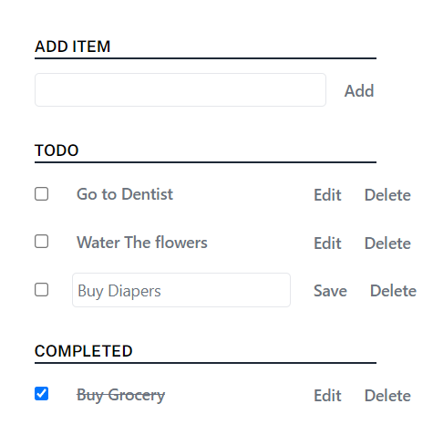

# TODO App

A basic local TODO web app

## Sample UI




FRONT-END

## 1. Run Locally

Clone the repository
```bash
  git clone https://github.com/M-A-N-O-J-R/gallabox_todo_app.git
```

Install dependencies

```bash
  npm install
```

test

```bash
  npm test
``

Start the Server

```bash
  npm start
``

## Features

- Ability to add a new Item
- List the todo Items
- Ability to edit and delete any todo Item
- Ability to make a todo item as complete
- List the completed Items
- Tested Individual Test using Jest (JavaScript testing framework)
- ESLint 
